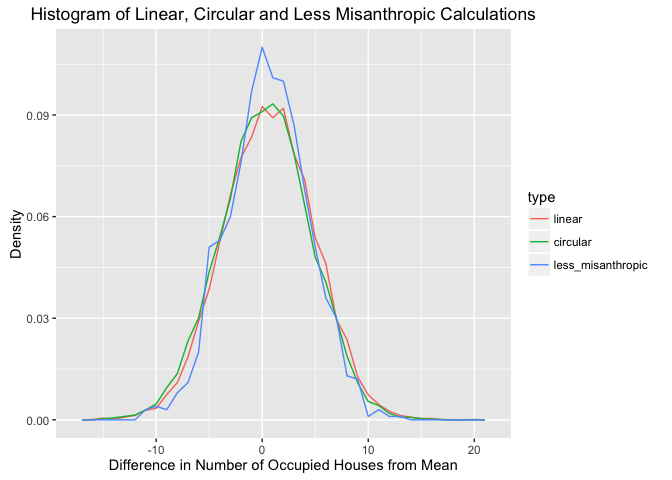

# Misanthropic Neighbours
Philip Bulsink  
April 22, 2016  


## Can You Solve The Puzzle Of Your Misanthropic Neighbors?

From [https://fivethirtyeight.com/features/can-you-solve-the-puzzle-of-your-misanthropic-neighbors/](https://fivethirtyeight.com/features/can-you-solve-the-puzzle-of-your-misanthropic-neighbors/)

The misanthropes are coming. Suppose there is a row of some number, `N`, of houses in a new, initially empty development. Misanthropes are moving into the development one at a time and selecting a house at random from those that have nobody in them and nobody living next door. They keep on coming until no acceptable houses remain. At most, one out of two houses will be occupied; at least one out of three houses will be. But what’s the expected fraction of occupied houses as the development gets larger, that is, as `N` goes to infinity?

Extra credit: It’s been a while, so let’s offer up a 🏆 Coolest Riddler Extension Award 🏆. Complicate the neighborhood, make the misanthropes friendlier, build better fences to make better neighbors, or something even more creative. Submit your extension and its solution via the form below. The winner gets a shiny emoji trophy next week.


##My Answer##
*See this answer with charts on [RPubs](http://rpubs.com/pbulsink/misanthropes)*

While I'm sure there's a way of solving this explicitly, I'm going to ty a nmerical brute force using Monte-Carlo like techniques. By solving for 1000 houses over and over and over, we'll get a distribution of results, between 0.33 and 0.50 occupied. 

Immediately, there's a question. Are the first house and last house on the block neighbours? Are the houses in a row, or are they around a square block, where everyone has two neighbours? That will change our results, of course. I'll work on the linear set first.

We'll start with a vector of True/False representing each house, say, `occupied`, and a variable for the number of houses. At first, all of the houses are available to be lived in.

Of course, in R, you can sum a vector (or sub-vector) of True/False to get the number of Trues in that vector, so this supplies easy searching of Trues.

With a list of houses available to be lived in, we can just loop over randomly choosing one, say `i`, marking that one as occupied (`occupied[i]<-TRUE`), and taking it, and the house on either side out of the `remaining` list. 


```r
misanthrope_linear_mc <- function(houses = 100) {
    occupied <- rep(FALSE, houses)
    remaining <- c(1:houses)
    
    while (length(remaining) > 0) {
        i <- sample(1:length(remaining), 1)
        occupied[remaining[i]] <- TRUE
        remaining <- remaining[!remaining %in% c(remaining[i], remaining[i] - 
            1, remaining[i] + 1)]
    }
    return(sum(occupied))
}
```

This is fairly quick. 1000 reps take 10-15 seconds on my older Macbook.

We can set up a looping structure for us:

```r
linear_reps <- function(reps, houses = 1000) {
    results <- rep(0, reps)
    for (i in c(1:reps)) {
        results[i] <- misanthrope_linear_mc(houses)
    }
    return(results)
}

linear_results <- linear_reps(10000)
```

If we run that 10000 times, we see that we have a mean of 432.6, with sd of 4.28, and a range from 416 to 448. This is the one line answer to the riddler quesiton: The fraction of occupied houses will be 0.433. 


```r
library(ggplot2)
linear_results <- data.frame(result = linear_results, type = rep("linear"))
ggplot(linear_results, aes(x = result, fill = type)) + geom_histogram(binwidth = 1) + 
    ggtitle("Histogram of Results for Linear Calculation") + xlab("Number of Occupied Houses") + 
    ylab("Frequency")
```


Now, if the block loops around on itself, that is, that the last house in `houses` is a neighbour to `1`, then we need to modify the code a bit. We'll check that, if someone moves into house 1, that they can't move into house `houses`, and vice-versa.


```r
misanthrope_circular_mc <- function(houses = 100) {
    occupied <- rep(FALSE, houses)
    remaining <- c(1:houses)
    
    while (length(remaining) > 0) {
        i <- sample(1:length(remaining), 1)
        occupied[remaining[i]] <- TRUE
        if (remaining[i] == 1) {
            remaining <- remaining[!remaining %in% houses]
        } else if (remaining[i] == houses) {
            remaining <- remaining[!remaining %in% 1]
        }
        remaining <- remaining[!remaining %in% c(remaining[i], remaining[i] - 
            1, remaining[i] + 1)]
    }
    return(sum(occupied))
}
```

Again, we'll quickly make a looping function:

```r
circular_reps <- function(reps, houses = 1000) {
    results <- rep(0, reps)
    for (i in c(1:reps)) {
        results[i] <- misanthrope_circular_mc(houses)
    }
    return(results)
}

circular_results <- circular_reps(10000)
```

And we'll look at these values: a mean of 432.3, with sd of 4.28, and a range from 417 to 452. 


```r
circular_results <- data.frame(result = circular_results, type = rep("circular"))
ggplot(circular_results, aes(x = result, fill = type)) + geom_histogram(binwidth = 1) + 
    ggtitle("Histogram of Results for Circular Calculation") + xlab("Number of Occupied Houses") + 
    ylab("Frequency")
```


Interestingly, while we expect to see a decrease in available houses by about the mean, the simulation is noisy enough that the loss of options is lost in the noise of the results. 

With `ggplot2` we can overlay those histograms to see if anything pops out.


```r
all_results <- rbind(linear_results, circular_results)

ggplot(all_results, aes(x = result, fill = type)) + geom_histogram(alpha = 0.3, 
    position = "identity", binwidth = 1) + ggtitle("Histogram of Results for Linear vs Circular Calculation") + 
    xlab("Number of Occupied Houses") + ylab("Frequency")
```


With enough simulations run (visible at 10000, not as well at 1000), we can see a slight bias to the left for the circular method, indicating a slight reduction in the number of available houses. At this point it's not likely to be statistically significant. 

##Extension##

What if they're only half misanthropic, if our misanthropes are married, and one spouse likes neighbours, but the other doesn't? That they don't mind having one neighbour, but not two? 

Let's see what happens. The expected density goes up, from 1/3 to 1/2, to 1/2 to 2/3. This time, the code is more complex, as there are a few allowances made by the individuals. We'll run this as a circular street, it meets our expectations better by not having edge cases. But, there's still lots of conditions to check, so the code is ugly. I'm sure it's optimizable, but I'm not too worried about that.


```r
less_misanthropic <- function(houses = 100) {
    get_remaining <- function(occupied) {
        remaining <- c(1:houses)
        if ((occupied[1] == TRUE) | (sum(occupied[c(2, houses)]) > 1)) {
            remaining <- remaining[!remaining %in% 1]
        }
        if ((occupied[houses] == TRUE) | (sum(occupied[c(1, houses - 1)]) > 
            1)) {
            remaining <- remaining[!remaining %in% houses]
        }
        if (occupied[2] == TRUE) {
            remaining <- remaining[!remaining %in% 2]
        }
        if (occupied[houses - 1] == TRUE) {
            remaining <- remaining[!remaining %in% (houses - 1)]
        }
        if ((occupied[1] == TRUE) && (occupied[houses] == TRUE)) {
            remaining <- remaining[!remaining %in% c(2, houses - 1)]
        }
        if ((occupied[houses - 1] == TRUE) && (occupied[houses - 2] == TRUE)) {
            remaining <- remaining[!remaining %in% 1]
        }
        if ((occupied[1] == TRUE) && (occupied[2] == TRUE)) {
            remaining <- remaining[!remaining %in% houses]
        }
        for (i in c(3:(houses - 2))) {
            if ((occupied[i] == TRUE) | (sum(occupied[c(i - 1, i + 1)]) > 1)) {
                remaining <- remaining[!remaining %in% i]
            }
            if ((occupied[i + 1] == TRUE) && (occupied[i + 2] == TRUE)) {
                remaining <- remaining[!remaining %in% c(i, i + 3)]
            }
            if ((occupied[i - 1] == TRUE) && (occupied[i - 2] == TRUE)) {
                remaining <- remaining[!remaining %in% c(i, i - 3)]
            }
        }
        return(remaining)
    }
    
    occupied <- rep(FALSE, houses)
    remaining <- c(1:houses)
    
    while (length(remaining) > 0) {
        i <- sample(1:length(remaining), 1)
        occupied[remaining[i]] <- TRUE
        remaining <- get_remaining(occupied)
    }
    
    return(sum(occupied))
}
```

Again, a looper. This is longer running code, so I'll keep it to 1000 loops of 1000 houses.

```r
lm_reps <- function(reps, houses = 1000) {
    results <- rep(0, reps)
    for (i in c(1:reps)) {
        results[i] <- less_misanthropic(houses)
    }
    return(results)
}

lm_results <- lm_reps(1000)
```

With less misanthropic people, we average 600.5 occupied, with an sd of 3.82, and a range of 589 to 613.


```r
lm_results <- data.frame(result = lm_results, type = rep("less_misanthropic"))
ggplot(lm_results, aes(x = result, fill = type)) + geom_histogram(binwidth = 1) + 
    ggtitle("Histogram of Results for Less Misanthropic Calculation") + xlab("Number of Occupied Houses") + 
    ylab("Frequency")
```


We can look at density efficiency of these, comparing the average density to the optimal, as `actual/optimal`. For the linear case, we have 0.87, for the circular case, we have 0.86, and for our 'less misanthropic' folks, we have 0.9. Of course, with less limitations, we can hit closer to our expected best density. 

If we put both histograms together, we see less distribution (also note our smaller `sd`, above). This is expected, think of the edge case of no restrictions, where the histogram is a single bar at 100% occupancy. 

```r
linear_results$result <- linear_results$result - as.integer(mean(linear_results$result))
circular_results$result <- circular_results$result - as.integer(mean(circular_results$result))
lm_results$result <- lm_results$result - as.integer(mean(lm_results$result))

all_results <- rbind(linear_results, circular_results, lm_results)

ggplot(all_results, aes(x = result, ..density.., color = type)) + geom_freqpoly(binwidth = 1) + 
    ggtitle("Histogram of Linear, Circular and Less Misanthropic Calculations") + 
    xlab("Difference in Number of Occupied Houses from Mean") + ylab("Density")
```



