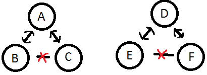
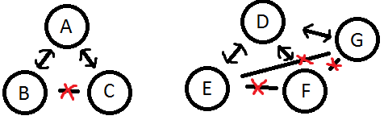
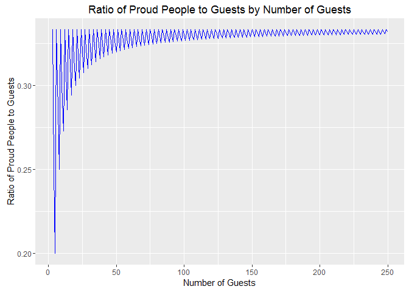

# Perplexing Partygoers
Philip Bulsink  
April 29, 2016  


## Can You Solve The Puzzle Of Your Misanthropic Neighbors?

From [http://fivethirtyeight.com/features/the-perplexing-puzzle-of-the-proud-partygoers/](http://fivethirtyeight.com/features/the-perplexing-puzzle-of-the-proud-partygoers/)

It's Friday and that means it's party time! A group of $n$ people are in attendance at your shindig, some of whom are friends with each other. (Let's assume friendship is symmetric - if person $A$ is friends with person $B$, then $B$ is friends with $A$.) Suppose that everyone has at least one friend at the party, and that a person is "proud" if her number of friends is strictly larger than the average number of friends that her own friends have. (A competitive lot, your guests.)

Importantly, more than one person can be proud. *How large can the share of proud people at the party be?*

##My Answer##
*This can be seen with images or charts at [RPubs](http://rpubs.com/pbulsink/perplexing_partygoers)

At first, this might seem like some sort of pagerank question, but it's not so complicated. 

Take at look at this photo:



Take a person $A$, with two friends $B$ and $C$. $A$ has two friends, but since $B$ and $C$ aren't friends, they only have one friend each ($A$). Thus, $A$ is proud, they have more friends than the average of their friends. 

Now, you can draw parallels with $D$, $E$, and $F$, and so on. Thus, $1/3$ of your guests are proud in this situation. 

So, as n goes to infinity, the number of proud people approaches $1/3*n$

Note that the question doesn't specify that the guests are your own friends. If that was the case, it would be $1/n$, that is, yourself.

Lets look at the edge cases. When $n$ is not divisible by three, we can optimize to the following arrangement:



At worst, for $n=5$, our ratio goes to $1/5$. 

This relationship can be described as: $$1/3[(n\;\mathrm{mod}\;3)/(n\backslash 3)$$ where $n\;\mathrm{mod}\;3$ is the modulous operator (eg. $5\;\mathrm{mod}\;3 = 2$), giving the remainder of division, and $n\backslash 3$ is the integer division (eg. $5\backslash 3 = 1$).

We can plot the ratio of proud people in R:

```r
library(ggplot2)
x <- 3:250
y <- 1/(3 + ((x%%3)/(x%/%3)))
df <- data.frame(x = x, y = y)

ggplot(data = df, aes(x = x, y = y)) + geom_line(color = "blue") + ggtitle("Ratio of Proud People to Guests by Number of Guests") + 
    xlab("Number of Guests") + ylab("Ratio of Proud People to Guests")
```



You can see in the plot how the trend approaches a floor maximum of $1/3$ (for $n mod 3 = 1$), and always has a real maximum at $1/3$.


